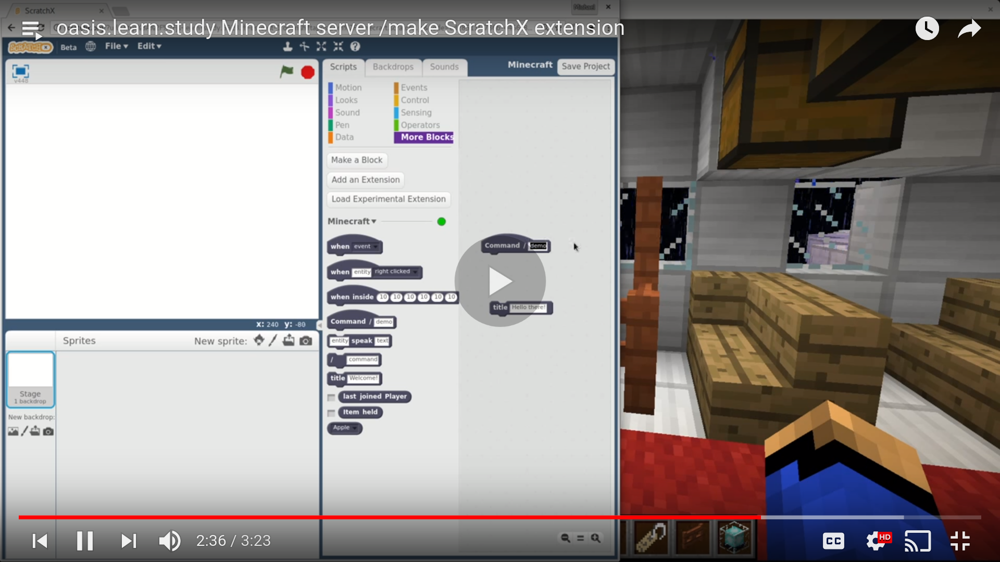

<link rel="apple-touch-icon" sizes="57x57" href="/images/favicon/apple-icon-57x57.png">
<link rel="apple-touch-icon" sizes="60x60" href="/images/favicon/apple-icon-60x60.png">
<link rel="apple-touch-icon" sizes="72x72" href="/images/favicon/apple-icon-72x72.png">
<link rel="apple-touch-icon" sizes="76x76" href="/images/favicon/apple-icon-76x76.png">
<link rel="apple-touch-icon" sizes="114x114" href="/images/favicon/apple-icon-114x114.png">
<link rel="apple-touch-icon" sizes="120x120" href="/images/favicon/apple-icon-120x120.png">
<link rel="apple-touch-icon" sizes="144x144" href="/images/favicon/apple-icon-144x144.png">
<link rel="apple-touch-icon" sizes="152x152" href="/images/favicon/apple-icon-152x152.png">
<link rel="apple-touch-icon" sizes="180x180" href="/images/favicon/apple-icon-180x180.png">
<link rel="icon" type="image/png" sizes="192x192"  href="/images/favicon/android-icon-192x192.png">
<link rel="icon" type="image/png" sizes="32x32" href="/images/favicon/favicon-32x32.png">
<link rel="icon" type="image/png" sizes="96x96" href="/images/favicon/favicon-96x96.png">
<link rel="icon" type="image/png" sizes="16x16" href="/images/favicon/favicon-16x16.png">
<link rel="manifest" href="/images/favicon/manifest.json">
<meta name="msapplication-TileColor" content="#ffffff">
<meta name="msapplication-TileImage" content="/images/favicon/ms-icon-144x144.png">
<meta name="theme-color" content="#ffffff">

# Play!

__OASIS.learn.study__ is an *OPEN* Minecraft server community.

Connect your Minecraft (PC Java Edition 1.12.2) to:

    oasis.learn.study

You can *chat* via [our Discord server](https://discord.gg/NPbutxm).

# MAKE

Type `/make` in the Minecraft chat and you get a link to Scratch to make your own plugin with blocks!  [More information...](users.md)

# More?

[News](news.md) | [FAQ](faq.md) | [Play](users.md) | [Ops](ops.md) | [DevOps](devops.md) | [Sources](sources.md)

See also http://www.vorburger.ch/kids-edutainment-links/ for more.

